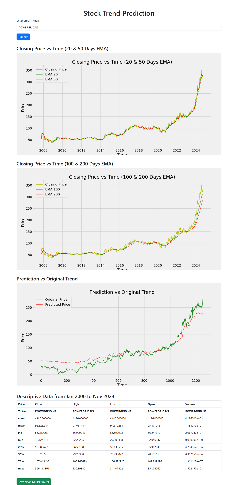

# 📈 Stock Market Prediction Web App

A machine learning-powered web application that predicts future stock trends based on historical data. This project combines deep learning models with a clean Flask interface to provide stock market trend forecasts. Ideal for financial data enthusiasts and beginners learning ML deployment.



---

## 🚀 Features

- 📊 Predicts stock price trends using historical data
- 🤖 Deep Learning model (`stock_dl_model.h5`)
- 🧠 Built with TensorFlow/Keras
- 🛠 Web UI with Flask and Jinja templates
- 📁 Accepts stock name/code as input and visualizes stock data
- 🌐 Ready to deploy on platforms like Heroku or Render

---

## 🛠️ Technologies Used

| **Area**        | **Tools / Libraries**              |
|-----------------|------------------------------------|
| __Programming__ | _Python 3_                         |
| __Web Framework__ | _Flask, Jinja2_                    |
| __ML/DL__       | _Keras, TensorFlow, NumPy, Pandas_ |
| __Visualization__ | _Matplotlib, Plotly_               |
| __UI Styling__  | _HTML, CSS_                        |

---
## 🧪 How the Model Works (For Beginners)

1. **Data Preparation**:
   - The model uses historical stock prices (like daily closing prices).
   - Data is normalized and structured into sequences for time-series forecasting.

2. **Model Architecture**:
   - We use an **LSTM (Long Short-Term Memory)** model because it works well with time-series data.
   - It learns from previous price trends to predict the next one.

3. **Model Saving and Deployment**:
   - Once trained, the model is saved as `stock_dl_model.h5`.
   - The Flask app loads this model and uses it to predict user-uploaded data.

---
## 📦 Installation

1. **Clone the repository**
    ```bash
   git clone https://github.com/yourusername/Stock-market-prediction.git
   cd Stock-market-prediction
2. **Create a Virtual Environment**
    ```bash
    python -m venv venv
    source venv/bin/activate   # On Windows: venv\Scripts\activate
3. **Install Dependencies**
    ```bash
   pip install -r requirements.txt
4. **Run the Application**
   ```bash
   python app.py
5. **Access the app**
   * Visit `http://127.0.0.1:5000/` in your browser
---
## 🧠 About the Model
   The model is trained using a sequence of stock prices to predict the next value, leveraging an _LSTM (Long Short-Term Memory)_ neural network. The trained model is saved as __stock_dl_model.h5__.

---

## 📁 Project Structure
   <pre>Stock-market-prediction/
   │
   ├── app.py                    # Flask app
   ├── main.ipynb                # Training and visualization notebook
   ├── stock_dl_model.h5         # Trained model file
   ├── powergrid.csv             # Sample CSV data
   ├── requirements.txt          # Python dependencies
   ├── static/                   # Static assets (CSS, images)
   ├── templates/                # HTML templates
   ├── .gitignore
   └── README.md</pre>
---
## 📥 How to Use It
   1. Open the app in your browser.
   2. Upload the name of the stock.
   3. Click __"Submit"__.
   4. View prediction results in chart format.

___

## 📝 License
   This project is licensed under the __MIT License__.<br>
   Feel free to use and modify it for your personal or academic projects.
 
___
## 🙋‍♂️ Author
   Debasish Paul<br>
   Aspiring Data Scientist & ML Engineer<br>
   [Visit My GitHub Repo](https://github.com/debasishpaul999/Stock-market-prediction.git)
   <br>[My GitHub Profile](https://github.com/debasishpaul999)